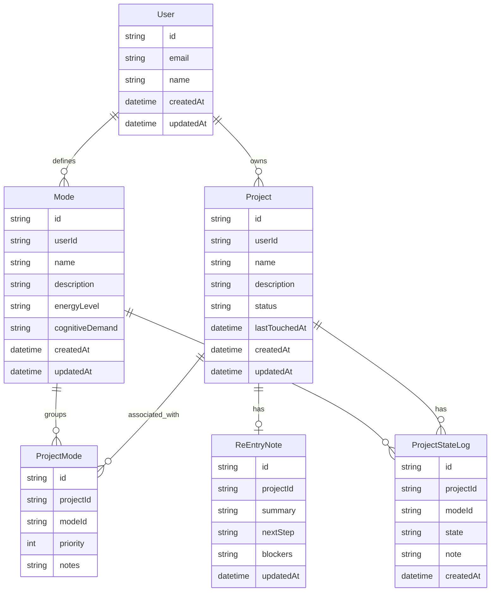

## Mode Switchboard

This application is built with neurospicy developers in mind. 

Many AuDHD management applications focus on time management. This application focuses on associating Projects with certain Modes. You can use this application to keep track of project state in an AuDHD-friendly way. 

This mermaids diagram represents data models. Do not modify the structure of the data models for now.

The first vertical slice has been tested with the UI. E2E Playwright tests are now available and shadcn is installed. 

# Rules of this Open Source

You push it, you own it, wherever it came from. Be prepared to explain any PRs in a code review or in comments.

